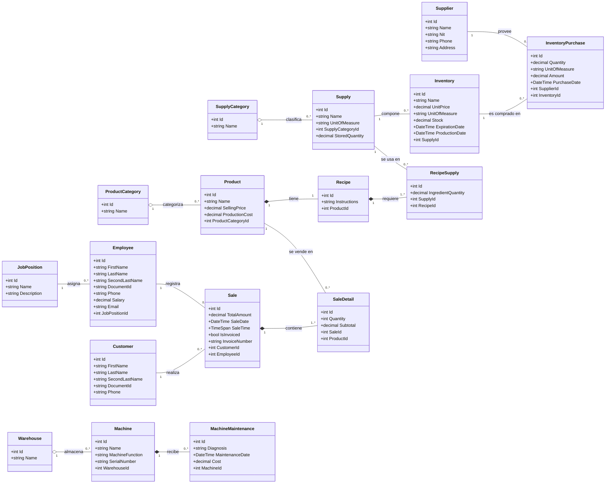

# Cafetería Aromas - Proyecto de Estructuras de Datos

Proyecto desarrollado en **ASP.NET Core MVC (.NET 10)** para la materia **Estructuras de Datos**. La aplicación utiliza una base de datos relacional para la gestión y persistencia principal del catálogo, recetas, inventario, clientes y ventas de la cafetería, complementada con la implementación de estructuras de datos dinámicas en memoria para resolver procesos específicos del sistema.


## 🛠️ Tecnologías Utilizadas

* **Framework:** .NET 10 (ASP.NET Core MVC)
* **Lenguaje:** C#
* **ORM:** Entity Framework Core
* **Base de Datos:** SQL Server
* **Arquitectura:** Modelo-Vista-Controlador (MVC)
* **IDE's Usados:** Rider, VS Code, Visual Studio


## 📂 Estructura del Proyecto

```text
CafeteriaAromas/
├── Controllers/         # Controladores MVC (Acceso, Menú, Pedidos, Productos, Recetas, etc.)
├── Data/                # Contexto de base de datos (EF Core) y almacenamiento en memoria
├── DataStructures/      # Implementación de estructuras de datos propias (Clases e Interfaces)
│   ├── Clases/
│   └── Interfaces/
├── Models/              # Entidades del dominio (Productos, Ventas, Inventario, Clientes, etc.)
├── ViewModels/          # Modelos de vista para la transferencia de datos a la UI
├── Views/               # Vistas Razor organizadas por módulos del sistema
├── appsettings.json     # Configuración global del proyecto y base de datos
└── Program.cs           # Punto de entrada y configuración de servicios / Middleware
```

## 📐 Diagrama de Clases (UML)


